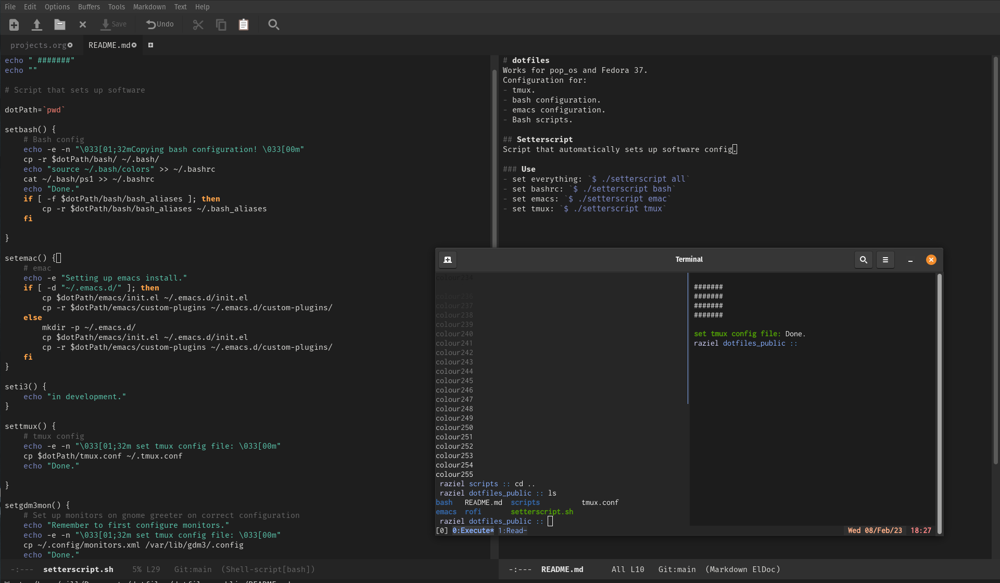

# dotfiles

*Works on pop_os and Fedora 37.*

Configuration for:
- tmux.
- bash.
- emacs.
  - NOTE: init file -> Frames,windows,buffer -> Change startup screen. Not replicable
- Bash scripts.

## Setterscript
Script that automatically sets up software config.

### Use
- set everything: `$ ./setterscript all`
- set bashrc: `$ ./setterscript bash`
- set emacs: `$ ./setterscript emac`
- set tmux: `$ ./setterscript tmux`
- set gdm3: `$ ./setterscript gdm3mon`
